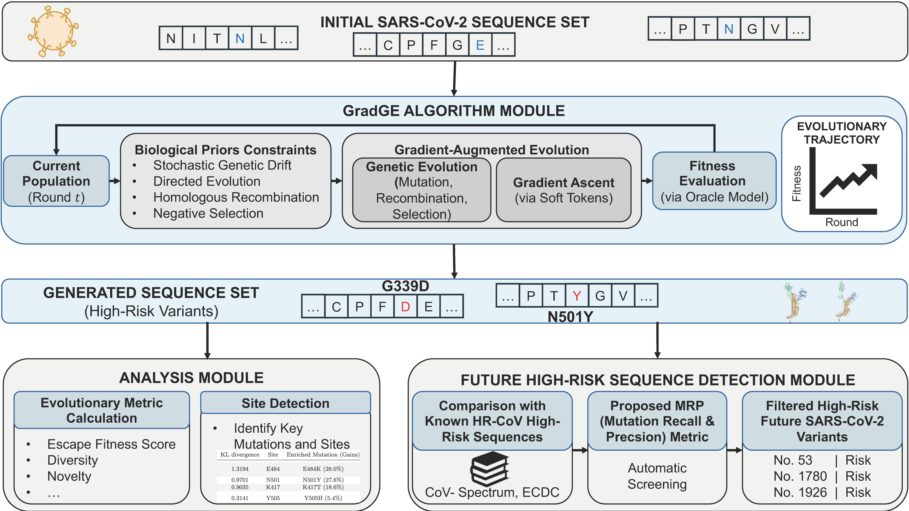

# GradGE

Repository for GradGE: Gradient-Augmented Genetic Evolution for Prediction of SARS-CoV-2 Variants with Enhanced Immune Escape Potentials.

[[link]()]

<p align="center">
  
</p>

## Environment

The code is tested on python=3.8.10, torch=2.4.1+cu121. Choose any proper PyTorch with its CUDA version.

```bash
conda create -n covid_predict python=3.8.10
conda activate covid_predict
pip install torch==2.4.1 torchvision==0.19.1 torchaudio==2.4.1 --index-url https://download.pytorch.org/whl/cu121
pip install -r requirements.txt
```

## Experiment

>  The core modules in the script are coming.

To perform the main experiment, run the following code.

```python
python src/main_3_vocs_20rounds.py
```

Please modify the parameters for specific task settings. Main parameters are `task_name, wt_seq, ini_seqs, INITIAL_SAMPLE_SIZE, ROUNDS, POP_SIZE, TARGET_SCORE, LOWER_BOUND, UPPER_BOUND, MAX_MUTATIONS`. See more details in the paper.

## HR-CoV: High-risk Variant Meta Dataset

We built the HR-CoV dataset in [`data/my_mutations.py`](data/my_mutations.py), serving as a reference for evaluating the algorithm's ability to predict future SARS-CoV-2 RBD variants. The data covers 41 (not all) high-risk variants up to February 2026. Preprocessing scripts are not included.

## Download trained fitness prediction model

The model checkpoint is provided by MLAEP repository.

```bash
pip install gdown
mkdir -p trained_model
gdown https://drive.google.com/uc?id=1em8015ooDVihvyKbcva9ty70mzoBFvgS -O trained_model/
```

## Acknowledgements

We thank the authors of the open-source project MLAEP, which this work is based on.

## License
This project is licensed under the MIT License.